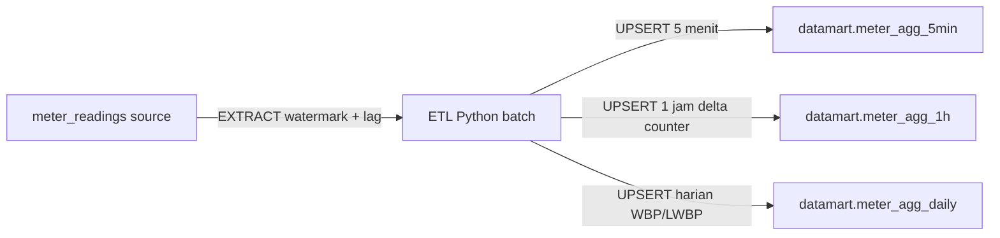

# Plan: ETL & Data Mart Energy (WBP/LWBP)

Scope saat ini: **ETL + skema data mart saja** (API ditunda).

## Prinsip

- **Proyek baru** — tidak bergantung pada `07_ETL`.
- Source: [`schema.sql`](schema.sql) → tabel `meter_readings` (semua `meter_id` / `device_type`).
- **Raw tidak dihapus** setelah ETL.
- **Raw tidak disalin** ke data mart — mart hanya menyimpan hasil agregasi/transformasi.
- Timezone tarif: **`Asia/Jakarta` (WIB)**.
- WBP: **[18:00, 22:00)** WIB (jam 18, 19, 20, 21). Selain itu = **LWBP**.

## Alur data



## Perhitungan energi (ImpEp / ExpEp)

Counter selalu naik. Pemakaian **per jam**:

```
kWh_jam_H = ImpEp(batas akhir jam H) − ImpEp(batas awal jam H)
Contoh: kWh 00:00–01:00 = ImpEp@01:00 − ImpEp@00:00
```

Implementasi praktis per `meter_id`:

1. Ambil pembacaan counter terdekat ke setiap batas jam WIB (toleransi mis. ±2 menit; jika kosong → null / skip jam itu).
2. `impep_kwh` / `expep_kwh` = selisih snapshot jam berikutnya − snapshot jam ini.
3. Jika delta **negatif** (reset meter) → simpan `0` dan set flag `counter_reset = true`.
4. Reactive (`Q1Eq`–`Q4Eq`) ikut pola delta yang sama di grain 5 menit & 1 jam.

Grain **5 menit**: delta dalam bucket = `last(counter) − first(counter)` di dalam bucket (setara MAX−MIN jika counter monoton naik).

Grain **harian**: jumlahkan delta jam; pecah:

- `impep_wbp_kwh` = sum jam WBP
- `impep_lwbp_kwh` = sum jam LWBP
- `impep_total_kwh` = keduanya (sama untuk `expep_*`)

## Skema data mart (`schema/datamart.sql`)

Schema PostgreSQL: `datamart` (boleh DB sama dengan source via `DATAMART_DB_URL`, atau DB terpisah).

| Tabel | Grain | Isi utama |
|-------|-------|-----------|
| `datamart.etl_state` | — | watermark `last_processed_until` per job |
| `datamart.meter_agg_5min` | 5 menit | agregat kualitas daya + delta energi + `tariff_band` (`WBP`/`LWBP`) + `device_type` |
| `datamart.meter_agg_1h` | 1 jam | delta energi dari selisih batas jam + agregat daya + `tariff_band` |
| `datamart.meter_agg_daily` | 1 hari (WIB) | total + pecahan WBP/LWBP + peak/avg penting |

**Kolom penting (selain energi) di 5 menit & 1 jam:**

- Identitas: `bucket_start`, `meter_id`, `device_type`, `sample_count`, `tariff_band`
- Tegangan avg: `uab/ubc/uca`, `ua/ub/uc`
- Arus avg: `ia/ib/ic`
- Daya aktif: `pt/pa/pb/pc` avg, `pt_max`, `active_power_demand_max`
- Daya reaktif avg: `qt/qa/qb/qc`
- PF avg: `pft/pfa/pfb/pfc`
- `frequency_avg`
- Energi delta: `impep_delta`, `expep_delta`, `q1eq_delta`…`q4eq_delta`

**Kolom khas harian:**

- `impep_wbp_kwh`, `impep_lwbp_kwh`, `impep_total_kwh`
- `expep_wbp_kwh`, `expep_lwbp_kwh`, `expep_total_kwh`
- `pt_avg`, `pt_max`, `active_power_demand_max`, `pft_avg`, `frequency_avg`, `sample_count`
- PK: `(bucket_start, meter_id)` dengan `bucket_start` = awal hari WIB (disimpan `TIMESTAMPTZ`)

Index: `(meter_id, bucket_start DESC)` per tabel; `(bucket_start, tariff_band)` di 5 menit/1 jam.

## Pipeline ETL (Python)

```
08_ETL and API/
  plan.md
  schema.sql
  schema/datamart.sql
  requirements.txt
  .env.example
  src/
    config.py
    db.py
    extract.py
    transform.py
    load.py
    pipeline.py
  main.py
```

**Stack:** Python 3.11+, `psycopg2`, `pydantic-settings`, `structlog` (jalankan via cron/Task Scheduler).

**Job flow:**

1. Baca watermark dari `etl_state` (default: sekarang − N hari untuk backfill pertama).
2. `EXTRACT` baris `meter_readings` di `[watermark, now() − lag)` — **lag 10–15 menit**.
3. `TRANSFORM` → baris 5 menit (semua meter).
4. `TRANSFORM` → baris 1 jam: snapshot batas jam + selisih ImpEp/ExpEp.
5. `TRANSFORM` → baris harian WIB + split WBP/LWBP.
6. `LOAD` UPSERT (`ON CONFLICT DO UPDATE`) ke ketiga tabel mart.
7. Update watermark. **Tidak ada DELETE** di source.

## Aturan WBP/LWBP

```text
local_hour = EXTRACT(HOUR FROM bucket_start AT TIME ZONE 'Asia/Jakarta')
tariff_band = CASE WHEN local_hour >= 18 AND local_hour < 22 THEN 'WBP' ELSE 'LWBP' END
```

Hari kalender untuk daily = `date_trunc('day', time AT TIME ZONE 'Asia/Jakarta')` lalu dikonversi kembali ke `TIMESTAMPTZ`.

## Konfigurasi

`.env.example`:

- `SOURCE_DB_URL` — DB berisi `meter_readings`
- `DATAMART_DB_URL` — target schema `datamart` (boleh sama dengan source)
- `ETL_LAG_MINUTES=15`
- `TIMEZONE=Asia/Jakarta`
- `WBP_START_HOUR=18`, `WBP_END_HOUR=22`

## Di luar scope (sementara)

- REST API
- Hapus/arsip raw
- Salin baris raw ke mart
- Integrasi ke kode `07_ETL`
